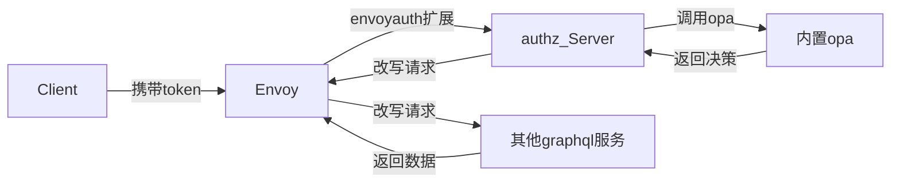

# envoy-open policy agent-graphql-demo

本示例主要用于集成envoy,open policy agent,graphql完成从envoy转发graphql鉴权到graphql执行的完整链路

```mermaid
graph LR
    A[Client] --携带token--> B[Envoy]
    B --envoyauth扩展--> C[authz_Server]
    C --调用opa--> OPA[内置opa]
    OPA --返回决策--> C[authz_Server]
    C --改写请求--> B
    B --改写请求--> D[其他graphql服务]
    D --返回数据--> B
```

## 技术栈

- golang
- open policy agent
- graphql
- gqlgen
- envoy
