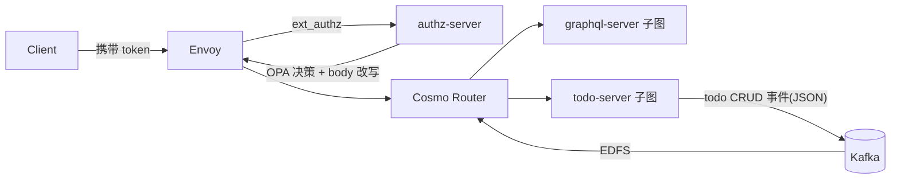

# envoy-opa-graphql-demo

本示例集成了 Envoy + OPA + Cosmo Router 联邦网关，演示从鉴权、请求改写到联邦查询与 Kafka 事件驱动订阅的完整链路。



## 组件

- `graphql-server`：Employee 子图（gqlgen + federation）
- `todo-server`：Todo 子图（gqlgen + 内存存储 + Kafka 事件发布）
- `cosmo-router`：联邦网关，聚合 `graphql-server` / `todo-server`，并通过 EDFS 对接 Kafka
- `authz-server`：Envoy ext_authz + OPA 策略评估
- `envoy`：统一入口，执行鉴权与请求改写后转发给 Cosmo Router

## 快速启动

```bash
make up
```

如需重新根据子图 SDL 生成 Router 执行配置：

```bash
make compose-router-config
```

## 联邦验证

```bash
make test-federation-todos
```

示例查询会跨子图聚合 Employee 与 todos：

```graphql
{
  employeeByID(id: "emp-1") {
    id
    name
    todos {
      id
      content
      updatedAt
      deleted
    }
  }
}
```
